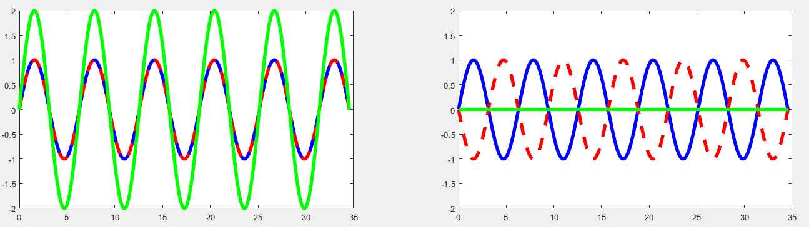
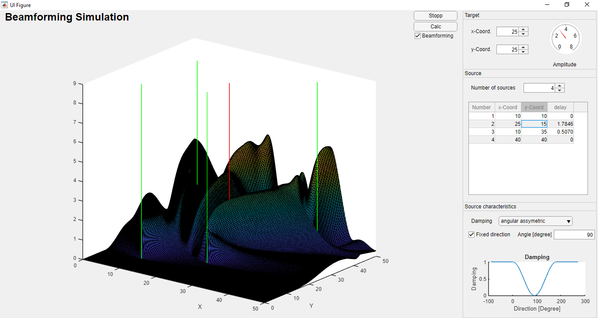

# DSP2 Project: Beamforming

AISE-M2017 - DSP2-PT Summer semester 2018

Authors:

- Robert Jöchl
- Philipp Mayer

## Introduction

Beamforming is a signal processing technique used to shape the beam in the direction of the receiver. Therefore a several sources send exactly the same signal, but with a different phaseshift/delay. Based on the physical principal of interference the waves superpose to a resultant wave forming a virtual "beam", which is targeted toward the destination.
The principle of superposition of waves states that when two or more propagating waves of same type are incident on the same point, the resultant amplitude at that point is equal to the sum of the amplitudes of the individual waves. Thus it is possible that the superposed signal can be at some points the sum of all maximum values of the single signals [1][2].

In the following image the principle of interference will be illustrated. In the left section the two signals (blue and red dashed) are perfect in phase and therefore results in a double as high superposed signal (green). In the right section the two signals have a phaseshift of 180°, thus the two signals will cancel out each other and the superposed signal is 0.

  

In our beamforming simulation we visulaize how, with a various amount of sources (which sends out the same wave with a diffrent delay (phase)), a maximum signal value can be achieved at a variable target point.

## Implementation
  
  

The upper image shows the GUI of our beamforming app. This GUI is roughly partitioned into four sections. On the left side a plot of the signal amplitude is shown for the area from 0 to 50 in 2-dimensional space. On the right there are three sections: The top one specifying the target, the middle one specifying the source and the bottom one specifying the radiation characteristics of the sources. The beamforming can be enabled/disabled by changing the checkbox beneath the calc button. After each change of any input source the calc button has to be pushed to apply the changes to the plot.

### Target section

In the target section the position of the target can be adjusted by two controls in the range from 0 to 50. The actual position of the target is indicated in the plot by the red vertical line. Additionally the amplitude at the target point is shown by the gauge which has the maximal possible amplitude (given by the number of sources) as maximal scale value.

### Source section

The source section provides control of the number of sources and there position. The number of sources can be varied from 1 to 10. Increasing/decreasing the number of sources will change the number of rows of the table. Each row corresponds to one source. The first column contains the ID number of the source, the second one the x-coordinate, the third one the y-coordinate and the fourth one the delay of the specific source in periods. As long as the beamforming isn't activated the delay for all sources will be 0. The actual positions of the sources are indicated in the plot by the green vertical lines.

### Source characteristics section

In this section the radiation characteristics of the sources are controlled. All sources have the same characteristics. There a three different modes available: One mode with no damping (1), one with angular symmetrical damping (2) and one with angular asymmetrical damping (3).  
In the first mode there is no damping in any direction, i. e. the signal has the same amplitude in each direction.
For the other two modes there is one direction with no damping. Aside of this direction the damping is increasing with 1-(1+cos(2*phi))/2 where phi is the angle between the direction with no damping and the actual direction. So the maximal damping will be reached at phi = +-90 degrees. The difference between the two modes is that for mode 2 the characteristic in the opposite direction (|phi| > 90 degrees) is symmetric whereas in mode 3 the damping in opposite direction is constant 1.  
For the direction with minimal damping also two modes exist. In default mode this direction is different for each source and given by the direction to the target point. By checking the "Fixed direction" checkbox the direction of the minimal damping can be fix at the value of the "Angle [degree]" input field between -180 degree and +180 degree where 0 degree means the positive x-direction. This holds for all sources.  
Additionally the damping characteristic is shown by the diagram at the bottom of this section. If the direction is not fixed, then 0 degree means the direction to the target.

### References
[1]"Wave interference", En.wikipedia.org, 2018. [Online]. Available: https://en.wikipedia.org/wiki/Wave_interference. [Accessed: 22- Jun- 2018].

[2]"What is Beamforming? - Definition from Techopedia", Techopedia.com, 2018. [Online]. Available: https://www.techopedia.com/definition/28945/beamforming. [Accessed: 22- Jun- 2018].